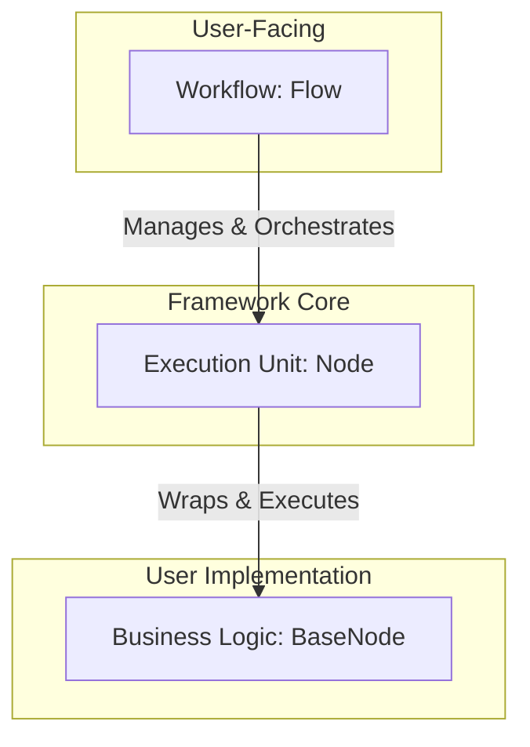
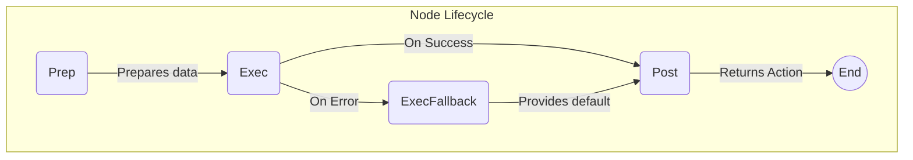
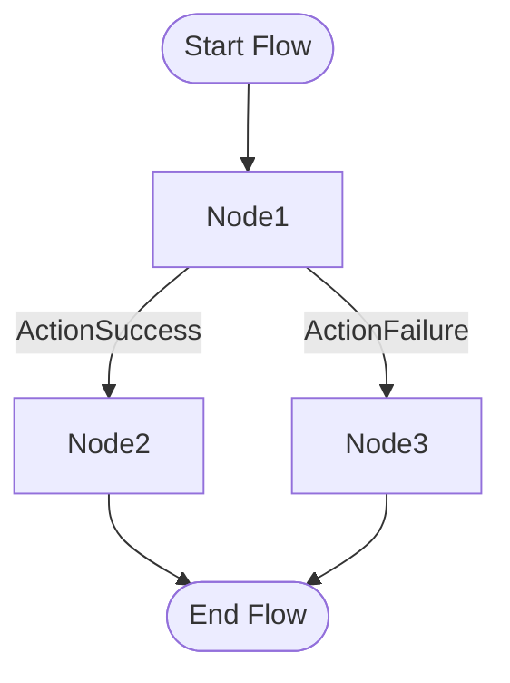

# PocketFlow Go

[](https://golang.org/dl/)
[](https://opensource.org/licenses/MIT)
[](https://goreportcard.com/report/github.com/alt-coder/pocketflow-go)
[](https://github.com/avelino/awesome-go)

A Go port of the [PocketFlow](https://github.com/The-Pocket/PocketFlow) framework - a minimalist 100-line LLM framework that captures the core abstraction of LLM frameworks: **Graph**.

## Table of Contents

- [Philosophy](#philosophy)
- [Why PocketFlow?](#why-pocketflow)
- [Architecture](#architecture)
  - [High-Level Architecture](#high-level-architecture)
  - [Node Execution Lifecycle](#node-execution-lifecycle)
  - [Flow Control](#flow-control)
- [Features](#features)
- [Installation](#installation)
- [Quick Start](#quick-start)
- [Core Components](#core-components)
- [Specialized Nodes](#specialized-nodes)
- [State Management](#state-management)
- [LLM Providers](#llm-providers)
- [Testing](#testing)
- [Project Structure](#project-structure)
- [Contributing](#contributing)
- [License](#license)
- [Roadmap](#roadmap)

## Philosophy

**Elegant Simplicity in Go's Ecosystem**

While the original PocketFlow proved that **"You only need 100 lines for an LLM Framework"** in Python, this Go port embraces a different philosophy: **"Elegant simplicity with Go's strengths"**.

Go's type system, concurrency model, and explicit error handling naturally lead to more verbose but safer code. This implementation focuses on:

- **Clarity over brevity**: Explicit interfaces and strong typing make the code self-documenting
- **Concurrency by design**: Built-in goroutine support for parallel node execution
- **Production readiness**: Comprehensive error handling and testing from day one
- **Zero vendor lock-in**: No dependencies on specific LLM providers
- **Composable architecture**: Easy to extend and customize for specific use cases

## Why PocketFlow?

**Focus on Core Abstractions, Not Framework Bloat**

While other frameworks add layers of abstraction and vendor-specific wrappers, PocketFlow focuses on the essential graph-based execution model:

| Framework | Abstraction | App-Specific Wrappers | Vendor-Specific Wrappers | Lines | Dependencies |
|-----------|-------------|----------------------|--------------------------|-------|--------------|
| LangChain | Agent, Chain | Many (e.g., QA, Summarization) | Many (e.g., OpenAI, Pinecone, etc.) | 405K | +166MB |
| CrewAI | Agent, Chain | Many (e.g., FileReadTool, SerperDevTool) | Many (e.g., OpenAI, Anthropic, Pinecone, etc.) | 18K | +173MB |
| LangGraph | Agent, Graph | Some (e.g., Semantic Search) | Some (e.g., PostgresStore, SqliteSaver, etc.) | 37K | +51MB |
| AutoGen | Agent | Some (e.g., Tool Agent, Chat Agent) | Many [Optional] (e.g., OpenAI, Pinecone, etc.) | 7K (core-only) | +26MB (core-only) |
| **PocketFlow (Python)** | **Graph** | **None** | **None** | **100** | **+56KB** |
| **PocketFlow Go** | **Graph + Types** | **None** | **None** | **~1K (core)** | **Minimal** |

**Key advantages of this Go implementation:**
- **Type Safety**: Compile-time guarantees vs runtime errors
- **Concurrency**: Built-in goroutine support for parallel execution  
- **Production Ready**: Comprehensive error handling and testing
- **Zero Vendor Lock-in**: No dependencies on specific LLM providers
- **Extensible**: Clean interfaces make it easy to add custom nodes

## Architecture

### High-Level Architecture

PocketFlow's architecture is composed of three core concepts: the **Flow** (the orchestrator), the **Node** (the execution unit), and the **BaseNode** (the user-defined logic).



### Node Execution Lifecycle

Each node follows a three-phase execution model: `Prep` -> `Exec` -> `Post`. This ensures a clear separation of concerns, from data preparation to execution and state management.



### Flow Control

Workflows are constructed by chaining nodes together. The `Action` returned by a node's `Post` method determines which node to execute next.



## Features

- **Three-Phase Node Execution**: Each node follows a Prep → Exec → Post pattern for clear separation of concerns
- **Built-in Retry Logic**: Configurable retry mechanisms with fallback support
- **Structured Output Validation**: Ensure LLM outputs match expected schemas
- **Concurrent Execution**: Support for parallel processing within nodes
- **Flow Orchestration**: Chain nodes together with action-based transitions
- **Provider Abstraction**: Pluggable LLM providers (OpenAI, Anthropic, etc.)
- **Extensible Architecture**: Easy to create custom node types

## Installation

```bash
go get github.com/alt-coder/pocketflow-go
```

## Quick Start

### Basic Custom Node

```go
package main

import (
    "fmt"
    "github.com/alt-coder/pocketflow-go/core"
)

type GreetingNode struct {
    name string
}

func (g *GreetingNode) Prep(state map[string]any) []string {
    name := "World"
    if userName, exists := state["user_name"]; exists {
        if nameStr, ok := userName.(string); ok {
            name = nameStr
        }
    }
    return []string{fmt.Sprintf("Generate a greeting for %s", name)}
}

func (g *GreetingNode) Exec(prepResult string) (string, error) {
    // In a real implementation, this would call an LLM
    return fmt.Sprintf("Hello, %s! Welcome to PocketFlow!", prepResult), nil
}

func (g *GreetingNode) ExecFallback(err error) string {
    return "Hello! Welcome to PocketFlow!"
}

func (g *GreetingNode) Post(state map[string]any, prepResults []string, execResults ...string) core.Action {
    if len(execResults) > 0 {
        state["greeting"] = execResults[0]
        return core.ActionSuccess
    }
    return core.ActionFailure
}

func main() {
    // Create flow with initial state
    state := map[string]any{"user_name": "Alice"}
    
    // Create and configure node with generic types
    greetingNode := &GreetingNode{name: "greeter"}
    node := core.NewNode[map[string]any, string, string](greetingNode, 3, 1) // 3 retries, 1 worker
    
    // Create flow and execute
    flow := core.NewFlow[map[string]any](node)
    action := flow.Run(state)
    
    // Access results from state
    fmt.Printf("Flow completed with action: %v\n", action)
    fmt.Println("Greeting:", state["greeting"])
}
```

## Core Components

- **BaseNode**: Interface defining the three-phase execution model (Prep → Exec → Post)
- **Node**: Wrapper providing retry logic and concurrency control, implements Workflow
- **Flow**: Orchestrates node execution as a subgraph, implements Workflow
- **State**: Shared state management across the workflow
- **Action**: Controls flow transitions between nodes

### Key Interfaces

```go
// Workflow - Common interface for execution and connection management
type Workflow[State any] interface {
    Run(state State) Action
    AddSuccessor(successor Workflow[State], action ...Action)
    GetSuccessor(action Action) Workflow[State]
}

// BaseNode - Core interface for implementing business logic
type BaseNode[State any, PrepResult any, ExecResults any] interface {
    Prep(state State) []PrepResult
    Exec(prepResult PrepResult) (ExecResults, error)
    ExecFallback(err error) ExecResults
    Post(state State, prepResults []PrepResult, execResults ...ExecResults) Action
}
```

## Specialized Nodes

### RetryNode
Handles structured output validation with automatic retries:

```go
config := retry.RetryNodeConfig{
    Name:         "DataExtractor",
    Prompt:       "Extract structured data as JSON",
    OutputSchema: MyStruct{},
    MaxRetries:   3,
    LLMProvider:  provider,
}
retryNode := retry.NewRetryNode(config)
```

## State Management

State is shared across all nodes in a flow:

```go
// Initialize state
state := map[string]any{
    "input": "user data",
    "config": map[string]any{
        "temperature": 0.7,
    },
}

// Execute flow
action := flow.Run(state)

// Access results
if result, exists := state["output"]; exists {
    fmt.Println("Result:", result)
}
```

## LLM Providers

### Mock Provider (for testing)

```go
provider := llm.NewMockProvider("test", []string{
    "Response 1",
    "Response 2",
})
```

### Custom Provider

Implement the `Provider` interface:

```go
type Provider interface {
    GenerateResponse(prompt string) (string, error)
    GetName() string
    SetConfig(config map[string]interface{}) error
}
```

## Testing

The framework includes comprehensive testing utilities:

```go
// Use mock providers for testing
mockProvider := llm.NewMockProvider("test", responses)

// Test individual nodes
result := node.Run(testState)

// Test complete flows
action := flow.Run(testState)
```

Run tests:

```bash
go test ./...
```

## Project Structure

```
.
├── core/
│   ├── interfaces.go
│   ├── node.go
│   ├── flow.go
│   └── types.go
├── examples/
│   ├── basic-chat/
│   └── basic_workflow/
├── llm/
│   ├── gemini/
│   └── mock.go
├── nodes/
│   ├── retry/
│   └── tools/
├── providers/
│   └── llm/
├── go.mod
└── README.md
```

## Contributing

1. Fork the repository
2. Create a feature branch
3. Add tests for new functionality
4. Ensure all tests pass: `go test ./...`
5. Submit a pull request

## Acknowledgements

A special thanks to [Zachary Huang](https://github.com/zachary62) for creating the original Python version of [PocketFlow](https://github.com/The-Pocket/PocketFlow). His work provided the foundational concepts and inspiration for this Go port.

## License

MIT License

## Roadmap

- [ ] Additional LLM provider implementations
- [ ] Advanced flow control patterns
- [ ] Monitoring and observability features
- [ ] Performance optimizations
- [ ] Web UI for flow visualization
- [ ] Plugin system for custom node types
